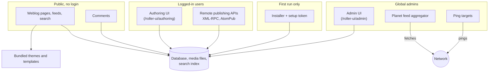
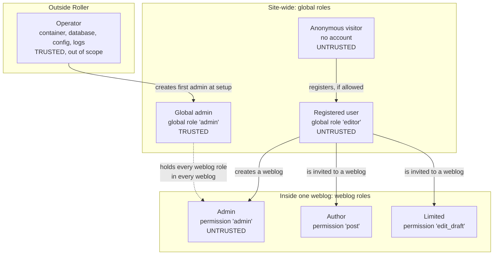
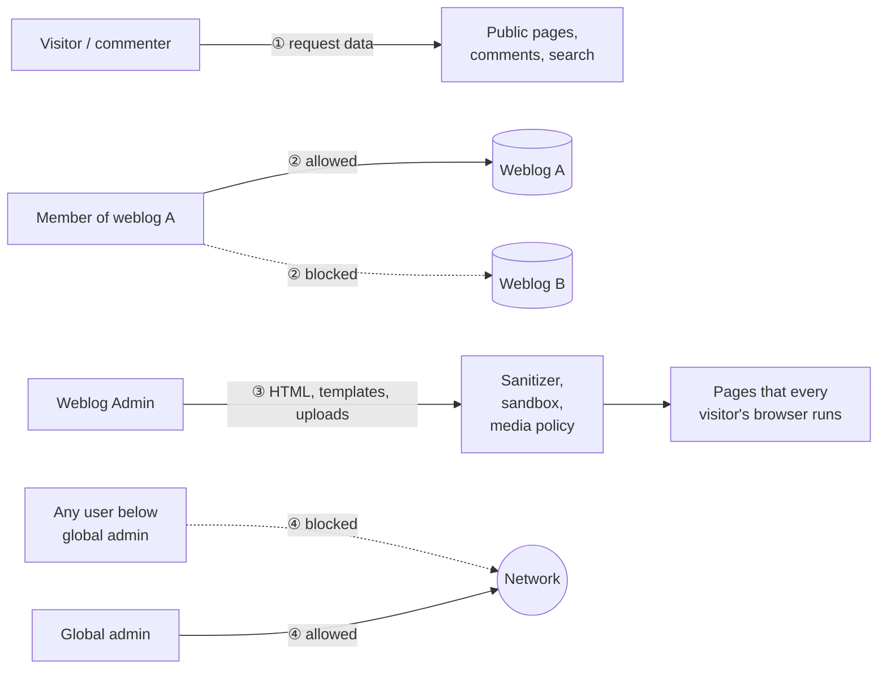
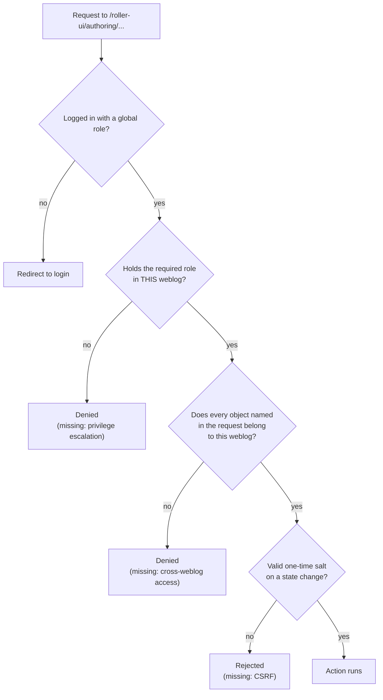
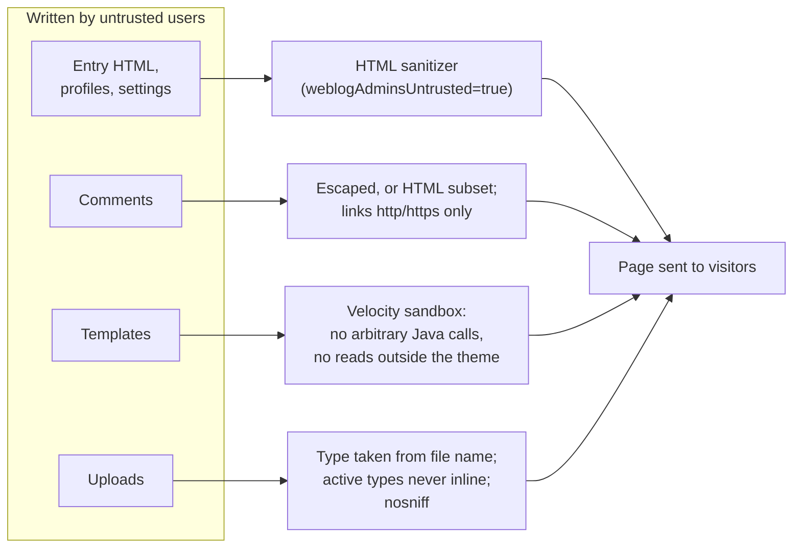
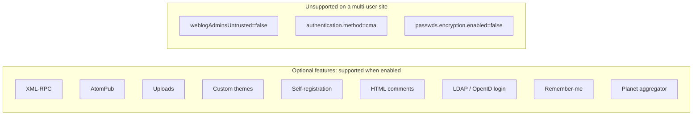
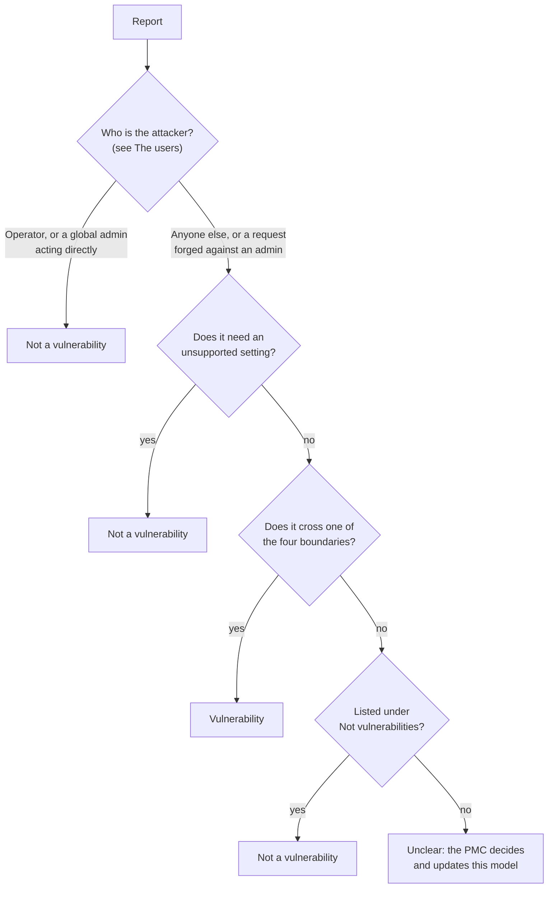

<!--
Licensed to the Apache Software Foundation (ASF) under one or more
contributor license agreements.  See the NOTICE file distributed with
this work for additional information regarding copyright ownership.
The ASF licenses this file to You under the Apache License, Version 2.0
(the "License"); you may not use this file except in compliance with
the License.  You may obtain a copy of the License at

    https://www.apache.org/licenses/LICENSE-2.0

Unless required by applicable law or agreed to in writing, software
distributed under the License is distributed on an "AS IS" BASIS,
WITHOUT WARRANTIES OR CONDITIONS OF ANY KIND, either express or implied.
See the License for the specific language governing permissions and
limitations under the License.
-->

# Apache Roller security model

## About this document

- **Version**: this model describes the Apache Roller 6.1.x release line.
- **Purpose**: it tells operators what Roller protects and what it leaves to them, and tells security researchers what counts as a vulnerability.
- **Reporting**: report a suspected vulnerability privately to security@apache.org, as described in [SECURITY.md](../SECURITY.md).
- **Vulnerabilities**: an issue is a vulnerability when an untrusted user crosses one of the boundaries below in a supported configuration.
- **Questions**: ask about the model on the Roller dev list, but never post details of a suspected vulnerability there.

## The one rule

Roller is one server that hosts many weblogs for people who do not
necessarily trust each other. The whole model follows from one rule:

> **What you may do in one weblog gives you nothing in another weblog, and
> nothing on the server.**

Only two parties are trusted: the **global admin**, who runs the site, and the
**operator**, who runs the server. Everyone else is a possible attacker. That
includes the admin of a weblog.

## Principles

Every change to Roller must keep these rules:

1. Rights in one weblog give nothing in another weblog or on the server.
2. Weblog admins are untrusted. Only global admins and the operator are
   trusted.
3. Every object named in a request is checked against the weblog the action
   runs on.
4. Content that users write never runs as script for other users.
5. Templates run in a sandbox. They cannot call arbitrary Java code or read
   files outside their theme.
6. Request data is data. Roller never runs it as code, and it never resolves
   external entities in XML it receives.
7. Every state-changing request from a logged-in user needs a one-time token
   (the *salt*).
8. Users below global admin cannot make the server fetch a URL of their
   choice.

## What Roller is made of

Everything in the Roller WAR is in scope, including the bundled themes. Build
and test tooling (`db-utils/`, `it-selenium/`, `testing/`, `docker/`,
`assembly-release/`) is not part of the product and is out of scope. The
Docker files are examples for development, not a supported deployment.

## The users

Roller has two layers of roles:

- **Global roles** apply to the whole site.
- **Weblog roles** apply to one weblog. A person can hold a different weblog
  role in each weblog they belong to, or no role at all.

Weblog roles stack: an Admin can do everything an Author can, and an Author can
do everything a Limited member can.

| User | Can do | Cannot do | Trusted? |
| --- | --- | --- | --- |
| **Anonymous visitor** | Read published entries, feeds and search; post comments; register, when registration is on | See drafts, settings or anything unpublished; change anything | No |
| **Registered user** (global `editor`) | Log in; edit own profile; comment; create weblogs, when the site allows it | Act in a weblog where they hold no role | No |
| **Limited** (`edit_draft`) | Create and edit draft entries in that weblog | Publish; manage comments, categories or media; act in other weblogs | No |
| **Author** (`post`) | Everything Limited can do; publish entries; manage comments and categories; manage media, when uploads are on | Change weblog settings, members, bookmarks, pings or design | No |
| **Admin** (`admin`) | Everything Author can do; weblog settings, members, bookmarks (including OPML import), pings, maintenance; theme and templates, when custom themes are on | Touch other weblogs; read server files; run Java code; read other users' private data; run script in other users' browsers | **No** |
| **Global admin** (global `admin`) | Everything in every weblog; users; site settings; Planet feeds; ping targets | Get shell or file access on the host | Yes |
| **Network attacker** | Read or change traffic when the site runs over plain HTTP | Anything, once the site runs over HTTPS | No |
| **Operator** | Owns the container, JVM, database, configuration files and logs | — | Yes, out of scope |

### Why the weblog Admin is untrusted

This is the most important line in the model. On a multi-user site, anyone who
can register can create a weblog and become its Admin. If weblog Admins were
trusted, every registered user would be trusted.

Roller's defaults reflect this. `weblogAdminsUntrusted=true` turns on HTML
sanitizing, and templates run in a sandbox built for untrusted authors.

A request forged cross-site that makes a logged-in user's browser act is an
attack by an anonymous visitor, not by that user.

## Where untrusted data enters

| Input | Who controls it |
| --- | --- |
| Any request to public pages, feeds and search | Anyone |
| Comments: name, email, URL, text | Anyone |
| Entry text, titles and summaries | Weblog members |
| Categories, bookmarks, profiles, weblog settings | Weblog members and Admins |
| Templates and stylesheets | Weblog Admins, when custom themes are on |
| Uploaded files: content, name, declared type | Weblog members, when uploads are on |
| OPML bookmark import | Weblog Admins |
| Remote API requests (XML-RPC, AtomPub) | Anyone, before authentication |
| Feeds fetched by Planet | Whoever runs the feed's host |
| Responses from ping targets | Whoever runs the ping target |
| Installer forms | Anyone, until setup is complete |

Only the operator controls `roller-custom.properties`, JNDI resources and the
database.

## The four boundaries

1. **Visitor → server.** All request data is untrusted. Roller escapes what it
   writes back into pages, never runs request data as code, and reads XML as
   data only. One request that causes runaway CPU or memory use (for example
   catastrophic regex backtracking) is a vulnerability. A slow response is not.
2. **Weblog → weblog.** A role in weblog A gives nothing in weblog B. This
   includes every object named by id in a request: entries, comments, media,
   templates, categories, bookmarks and members. A global admin holds every role
   in every weblog.
3. **Weblog author → everyone else.** Content that members and Admins write
   runs in other people's browsers. Roller keeps it from attacking visitors,
   other users or the server:
   - HTML in entries, profiles and settings is sanitized when
     `weblogAdminsUntrusted=true`.
   - Comments are always escaped, or limited to a small HTML subset. Comment
     links and author URLs must be `http` or `https`.
   - Templates run in the sandbox.
   - Uploaded files are never served as active content (see below).
4. **Server → network.** Users below global admin cannot make the server fetch
   a URL of their choice. Entry enclosure URLs are stored, not fetched. Global
   admins can point the server at any URL through Planet feeds and ping targets.
   That is by design.

Two more rules protect the whole site:

- **Accounts.** Passwords are stored as bcrypt hashes. Roller takes the user's
  identity from the login, never from request data. A password change ends the
  user's other sessions.
- **Setup.** Before setup, the installer needs a one-time token that Roller
  writes to the server log. Once setup is complete, the installer is closed for
  good.

## How a request is checked

Every request to the authoring UI passes these checks in order. A missing check
creates a predictable class of bug.

The remote APIs (XML-RPC, AtomPub) authenticate with a username and password
instead of a session and salt. They apply the same role and object
checks.

## How content is kept safe

Uploaded files get their type from the file name, not from what the browser
claims. Only passive types such as images, audio, video, PDF and plain text are
shown inline. Everything else, including HTML and SVG, is sent as a download.

## Settings

A bug in an optional feature is a vulnerability when the feature is enabled.

| Setting | What it changes |
| --- | --- |
| `weblogAdminsUntrusted` | `true` (default) sanitizes HTML from weblog members. Set `false` only when every weblog admin is trusted, such as on a solo blog. |
| `themes.customtheme.allowed` | Lets weblog Admins edit templates. Templates stay in the sandbox. |
| `uploads.enabled` | Lets members upload media files. |
| `webservices.enableXmlRpc`, `webservices.enableAtomPub` | Turn on the remote publishing APIs. They use the same weblog roles as the UI. |
| `users.registration.enabled` | Lets anyone create an account. |
| `users.comments.htmlenabled` | Allows a small HTML subset in comments. |
| `authentication.method` | `db`, `ldap`, `openid` or `db-openid`. `cma` is not usable. |
| `rememberme.enabled` | Keeps users logged in with a cookie. Use only over HTTPS. |
| `passwds.encryption.enabled` | `false` stores plaintext passwords. Not supported. |

## Libraries

Roller decides how it configures and calls each library. A library bug hit
while Roller uses the library correctly belongs to that library's project. Roller
passing untrusted input to a library in an unsafe way is a Roller bug.

## Not vulnerabilities

Roller does not protect against:

- **The operator or host**, or anyone who can edit the configuration or the
  database.
- **A global admin misusing the admin UI.** A request forged against a logged-in
  global admin is still a vulnerability.
- **Plain HTTP.** TLS is the operator's job.
- **Floods, brute-force login attempts and spam.** Roller has no rate limit or
  login lockout. The comment math question is an anti-spam measure, not
  authentication.
- **Browsers out of vendor support.** Script that runs only in such browsers
  (for example old Internet Explorer modes) is not a vulnerability. A payload
  that also runs in a current browser is.
- **Forged anonymous comments.** A comment forged cross-site carries no
  identity, so it gains the attacker nothing.
- **Unsupported settings**, listed under Settings above.
- **Partial writes** when a multi-step operation fails. That is a bug, not a
  vulnerability.

## Operator checklist

- Serve Roller only over HTTPS, and set the session cookie `Secure` flag in the
  servlet container. Roller sets `HttpOnly` but not `Secure`.
- Keep `weblogAdminsUntrusted=true` unless every weblog admin is trusted.
- Enable custom themes, uploads, XML-RPC and AtomPub only when you need them.
- Restrict access to the server log. It holds the setup token during
  installation and upgrades.
- Keep the database, data directories and `roller-custom.properties` private.
- If the server can reach internal services, put egress rules on Roller's
  outbound traffic (Planet, pings).
- Run the current release. Older releases are not patched.

## Common mistakes

- Setting `weblogAdminsUntrusted=false` on a multi-user site to allow rich HTML.
- Enabling custom themes and assuming templates are harmless. They are
  sandboxed, but they run on every page view.
- Running over plain HTTP with remember-me enabled.
- Running setup on a host where other people can read the log.

## Judging a report

